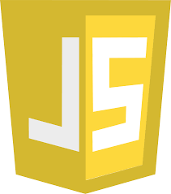

### Welcome! I'm José 👋😄 

<h2>
  I am a web developer with a specialty in frontend and good backend management. Results-oriented, always putting the customer first and guiding him to find the best version of his product 💪
Eternal self-taught, always learning, practicing and improving my knowledge. I have certifications of my knowledge and projects that support them 👨‍💻
</h2>

 

<h3>
  Skills
</h3>

<b>Language</b>

<b>Frontend</b>

  

<b>Backend</b>

  
  

<b>Database</b>

  

 

  

  <b>Job Profile and contact</b>
  

    

  

